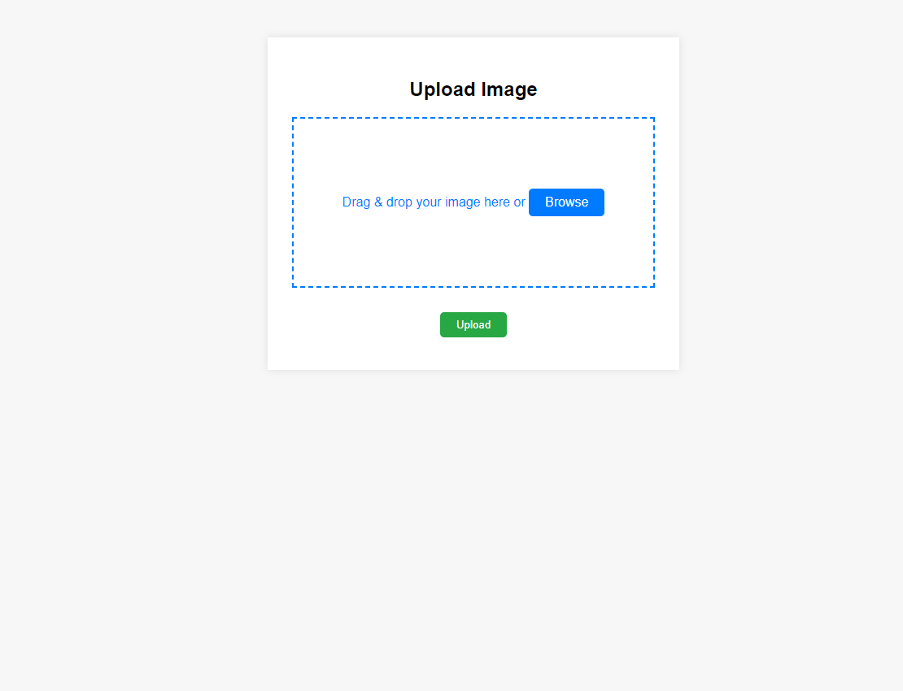
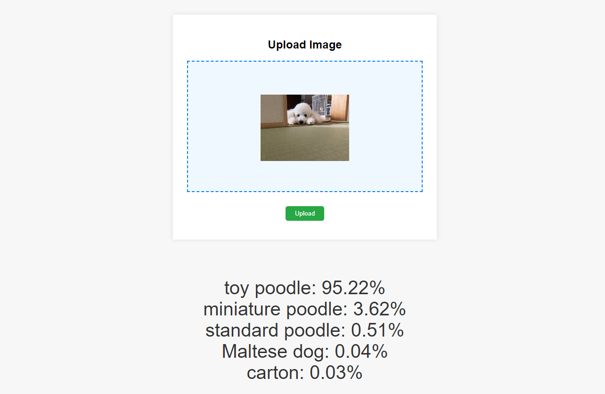
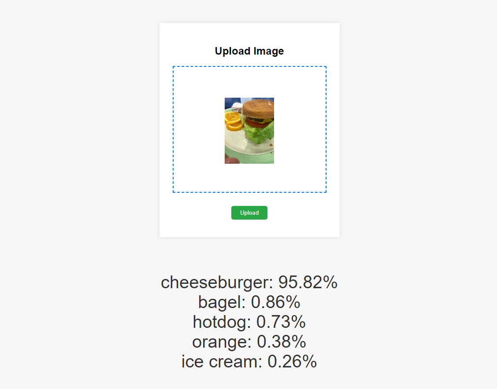
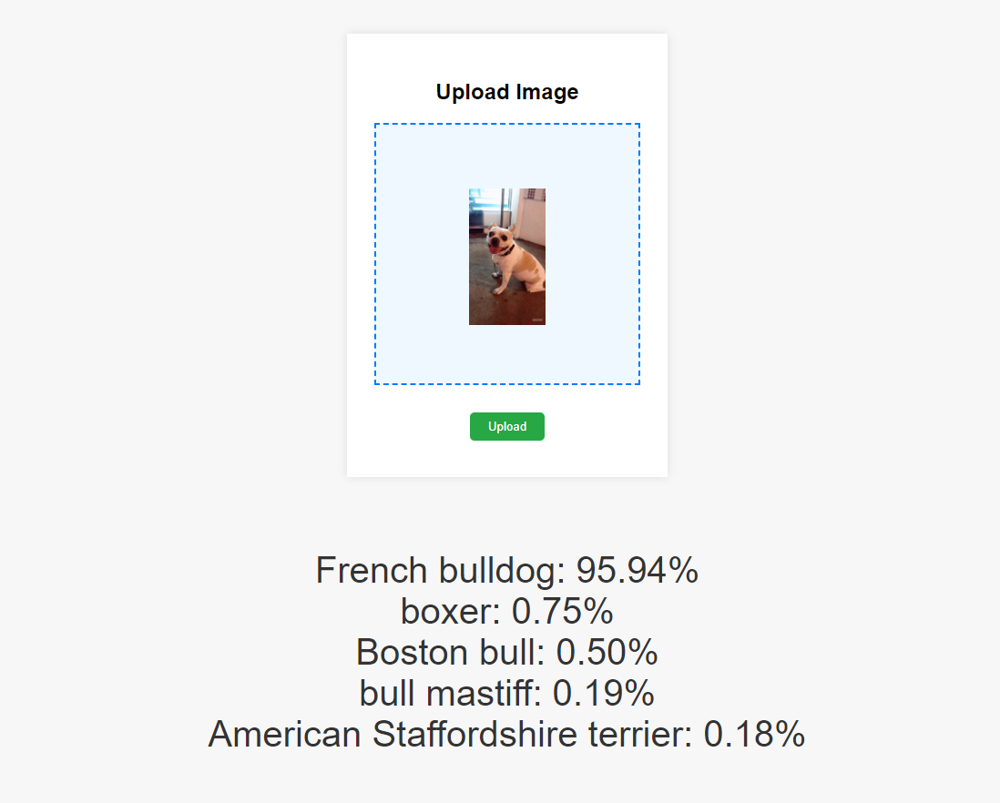

# 画像分類プロジェクト

このプロジェクトは、Web上で画像をアップロードし、画像分類の結果を表示するアプリケーションです。使用するモデルは`resnet50.a1_in1k`で、imagenet-1kというデータセットにおいてトップ5に正解がある確率は95%です。

## タイトル画面

## 出力例
トイプードル

ハンバーガー

フレンチブルドッグ

## 始め方

プロジェクトをローカルで実行するには、以下の手順に従ってください。

### 実行環境

- Python 3.10.12
- pip 22.0.2

### インストール

プロジェクトの依存関係をインストールするには、以下のコマンドを実行します。

'''
pip install -r requirements.txt
'''

### アプリケーションの実行

アプリケーションを起動するには、以下のコマンドを実行します。

'''
python app.run
'''

### ローカルでの接続

アプリケーションが起動したら、ブラウザを開いて以下のアドレスにアクセスします。

'''
http://localhost:5000
'''
